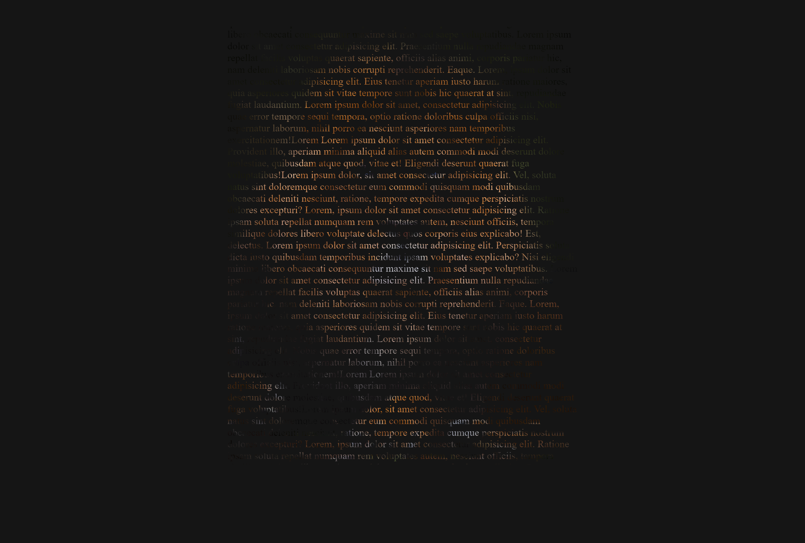

# Retrato de texto com CSS

Desenvolvido para aprendizado. Realizado efeito de retrato de texto com CSS. 17/10/22

[🔗 Clique aqui para acessar] (https://michel-maia.github.io/Retrato-de-texto-com-CSS/)

## 💻 Tecnologias

- HTML
- CSS

## Referência

- [Youtube] https://www.youtube.com/c/dpwoficial

- [mozilla] https://developer.mozilla.org/en-US/docs/Web/CSS/background-clip

img 
https://unsplash.com/

